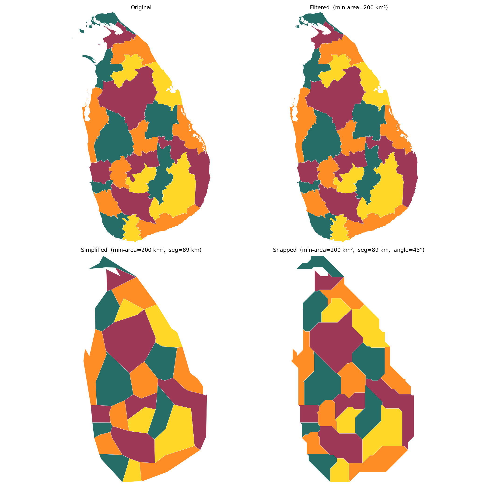
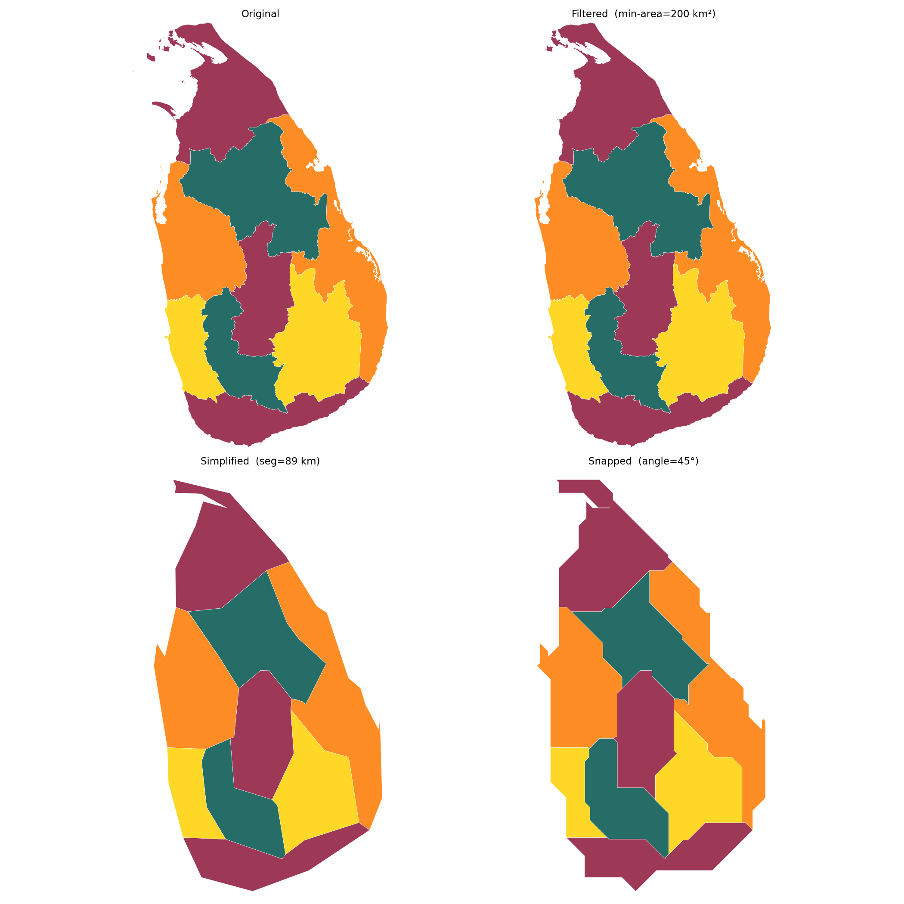
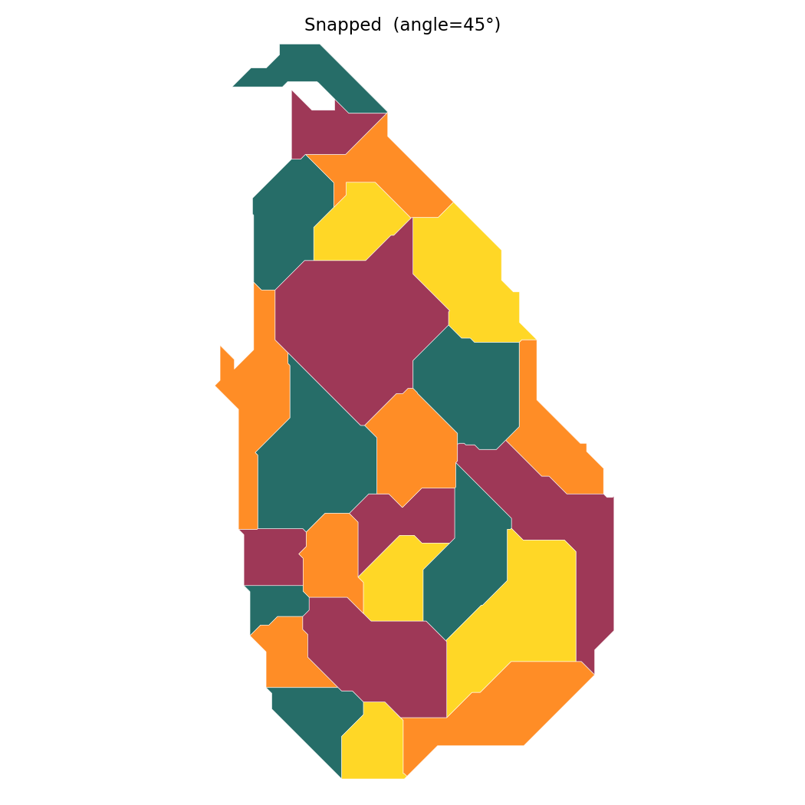
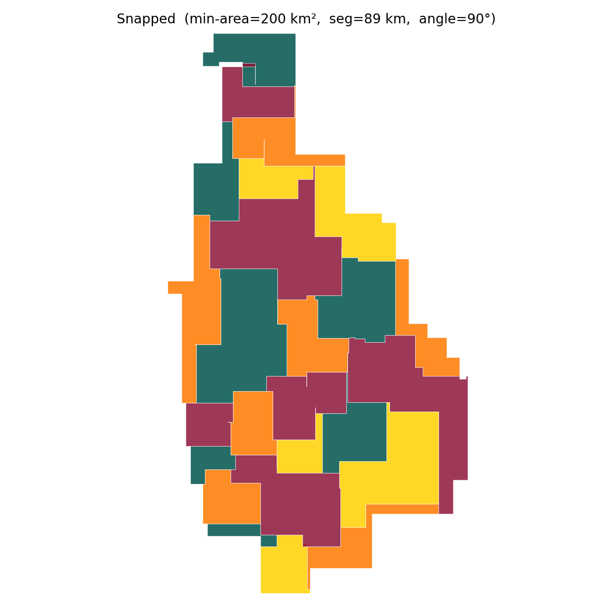

# octilinear

A Python pipeline that converts Sri Lanka's administrative boundary TopoJSON files into **octilinear schematic maps** — diagrams where every boundary segment runs at a multiple of 45°, trading geographic precision for visual clarity.

Think Harry Beck's London Underground map, applied to administrative boundaries. Regions become clean, readable polygons whose shape, position, and neighbours are preserved, even if their exact area and coastline are not. The result is far more useful than a raw geographic map for displaying statistical data by region.



---

## What is "octilinear"?

From Latin *octo* (eight) + *linearis* (of lines): a diagram where lines run in exactly eight directions (every 45°). The pipeline generalises this to any angle step that divides 360° — 90° (rectilinear), 60° (hexilinear), 45° (octilinear, default), 30°, etc.

---

## Pipeline

Three steps, applied in order:

- **Filter** — drop sub-polygons below `min_area` km² to remove tiny islands that become noise after simplification. Output: `data/generate/filtered/`
- **Simplify** — resample arcs so consecutive vertices are ~`segment_length`° apart. Output: `data/generate/simplified/`
- **Snap** — insert an elbow point into each off-grid segment so both halves land on the angle grid. Output: `data/generate/octilinear/` and `images/octilinear/<stem>/`

Each run produces five images inside its own folder:
- `all.png` — 2×2 panel showing all four stages
- `original.png`, `filtered.png`, `simplified.png`, `octilinear.png` — individual panels

Output filenames encode all parameters so runs never overwrite each other:
```
<base>.min-area-<v>.seg-<v>.angle-<v>
```

---

## Installation

```bash
pip install -r requirements.txt
```

---

## Usage

```bash
python workflows/pipeline.py [input ...] \
    [--segment-length DEG] \
    [--min-area KM2] \
    [--angle-step DEG]
```

- `input` — one or more TopoJSON files (default: all `data/original/*.topojson`)
- `--segment-length` — arc-segment target length in degrees (default `0.02` ≈ 2.2 km). Larger → coarser.
- `--min-area` — drop sub-polygons below this area in km² (default `1.0`). Larger → more islands removed.
- `--angle-step` — snapping grid in degrees, must divide 360 (default `45`). 45 = octilinear, 60 = hexilinear, 90 = rectilinear.

To regenerate all images referenced in this README:
```bash
bash workflows/pipeline.sh
```

Colors use a greedy 4-coloring seeded from the Sri Lankan flag palette (maroon, saffron, green, gold) so no two adjacent regions share a color.

---

## Examples

### Provinces



---

### Districts


---

### Octilinear vs hexilinear vs rectilinear

The `--angle-step` controls how many directions are allowed. Fewer directions produce blockier, more diagrammatic shapes.

**45° — octilinear (8 directions, default)**


**60° — hexilinear (6 directions)**


**90° — rectilinear (4 directions)**


---

## Data

Source files in `data/original/` are TopoJSON exports of Sri Lanka's official administrative boundaries. TopoJSON encodes shared borders as single arcs, so simplification and snapping never introduce gaps between adjacent regions.

- `countrys.topojson` — 1 feature, 185 142 points
- `provinces.topojson` — 9 features, 244 740 points
- `districts.topojson` — 25 features, 281 433 points
- `dsds.topojson` — 339 features, 592 114 points
