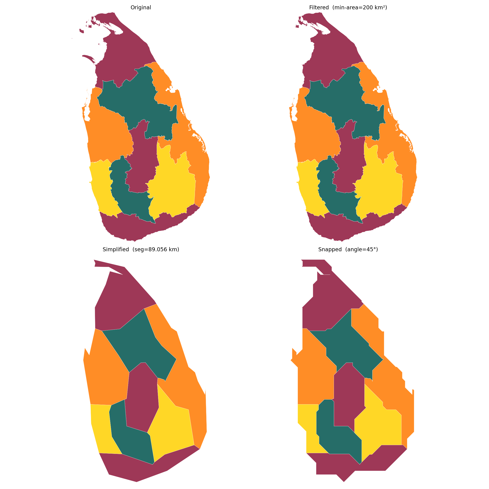
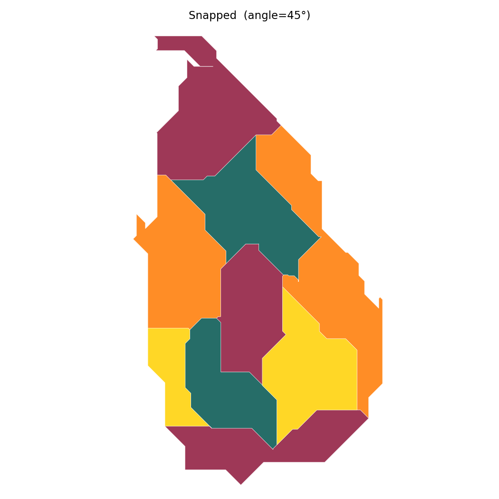
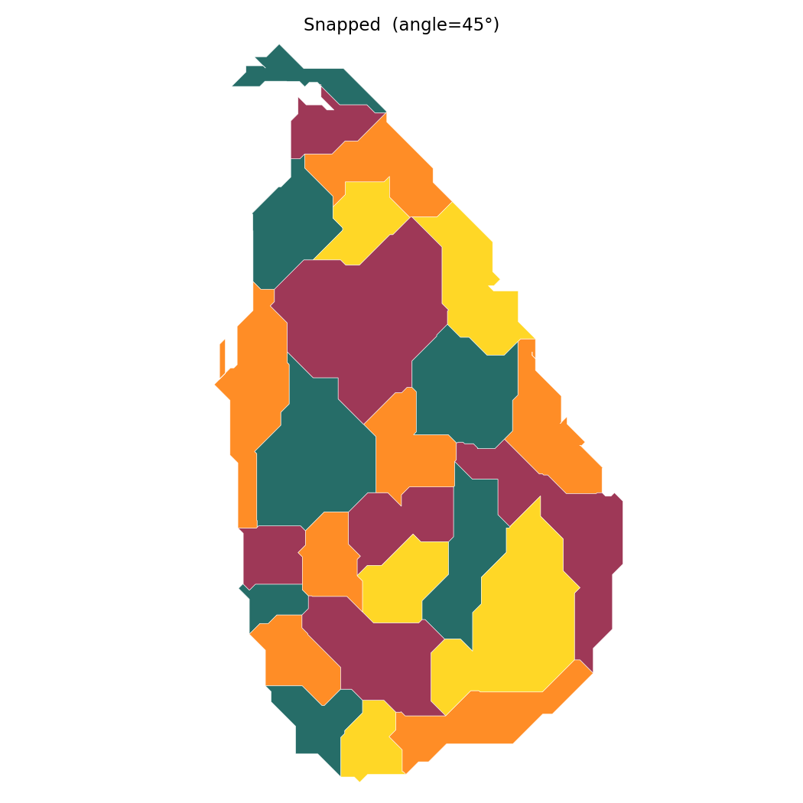
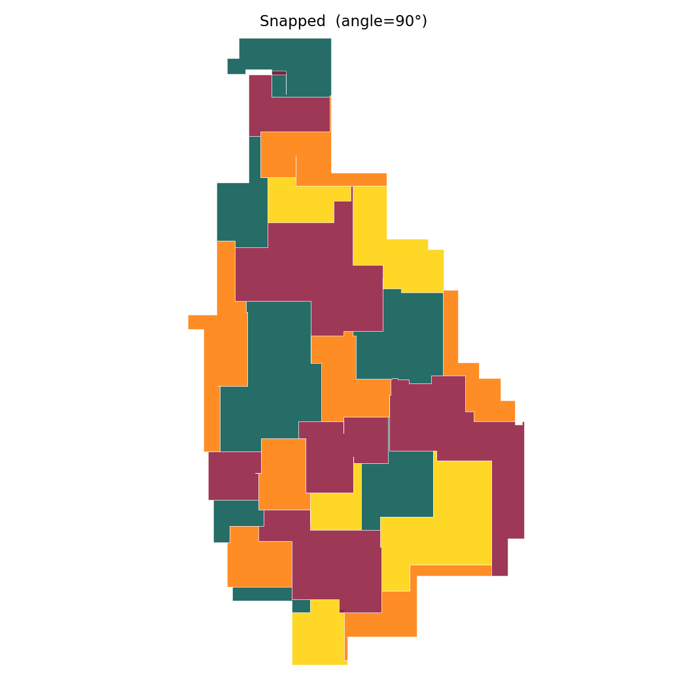
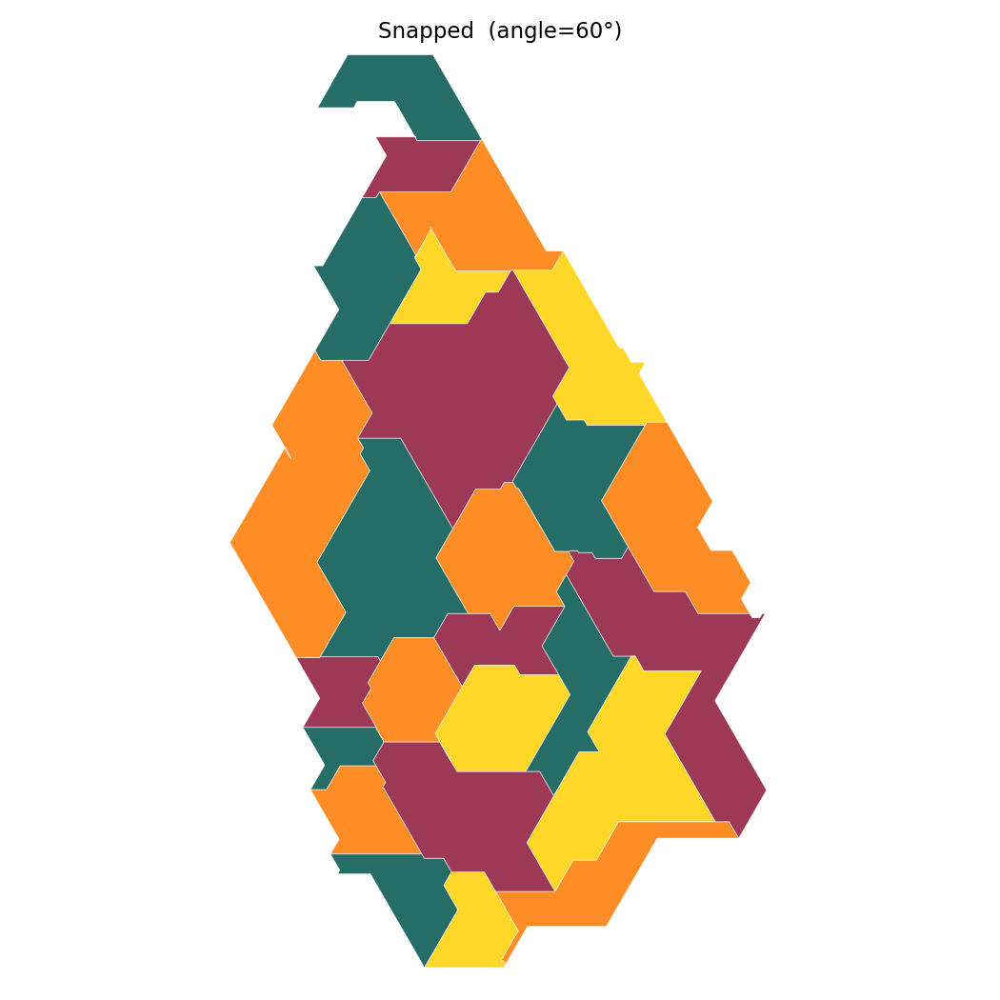
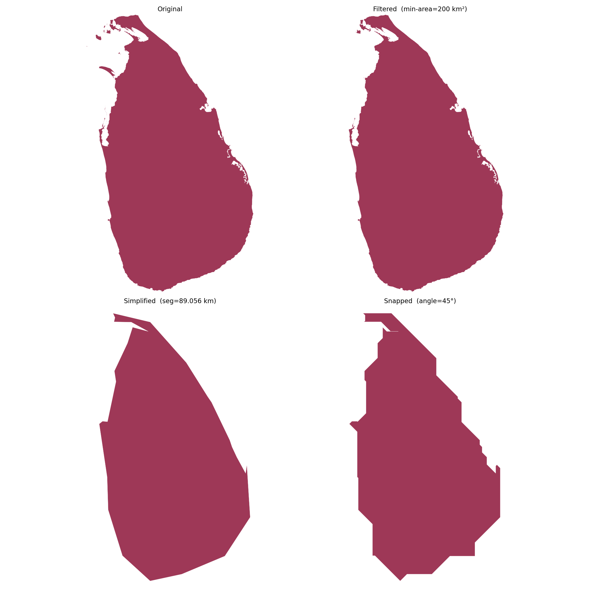
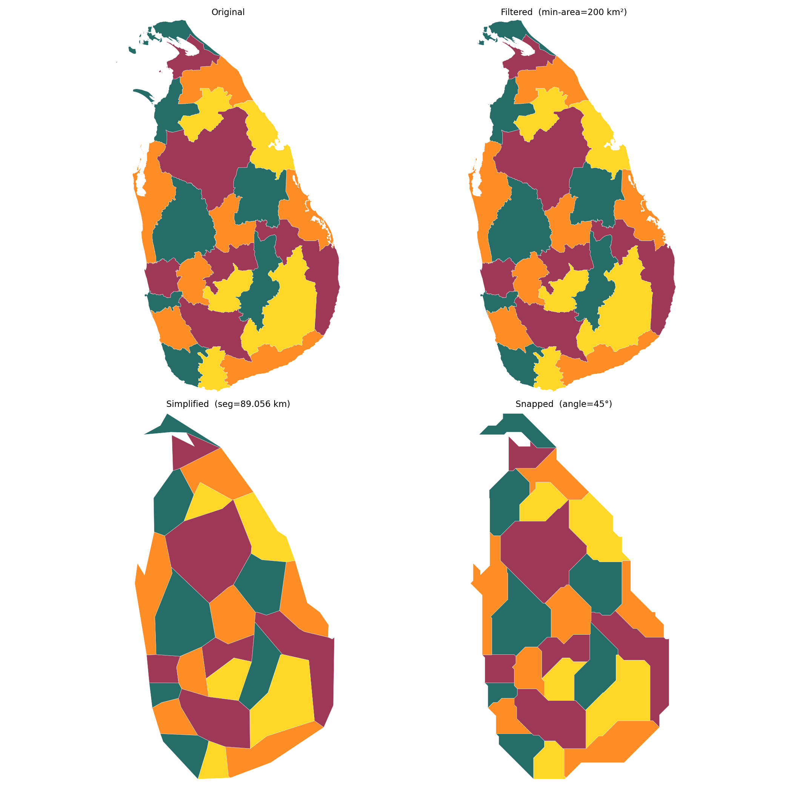
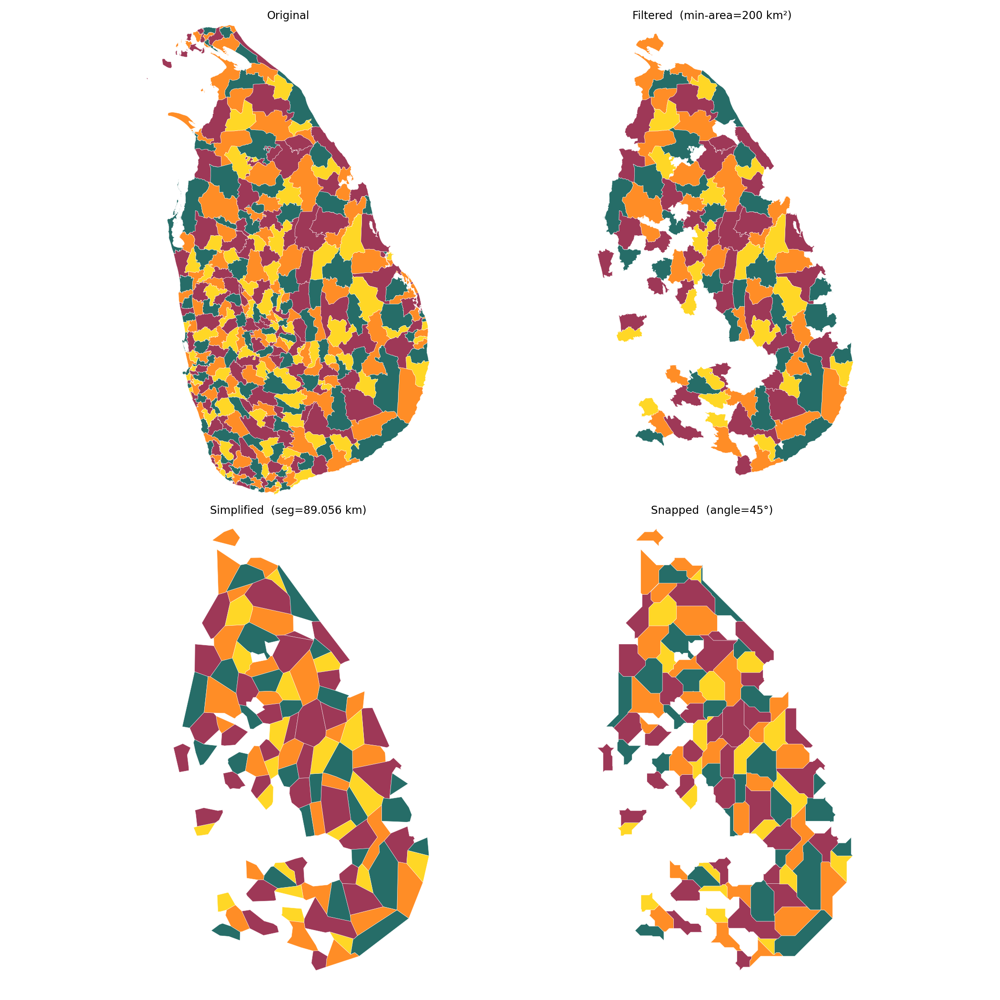

# octilinear

## What does "octilinear" mean?

The word is built from two roots:

- **octi-** (Latin *octo*, eight) — eight allowed directions, one every 45°
- **-linear** (Latin *linearis*) — composed of straight-line segments

An octilinear diagram is therefore one in which every line runs at a multiple
of 45°: horizontal, vertical, or diagonal. The term is best known from
transit maps (the London Underground style), but applies equally to any
schematic where region boundaries are constrained to that grid.

The generalisation implemented here accepts any angle step that divides 360°
evenly — 90° (rectilinear, 4 directions), 60° (hexilinear, 6 directions),
45° (octilinear, 8 directions), 30° (dodecalinear, 12 directions), and so on.

---

## What are octilinear maps and why do they work?

A conventional geographic map faithfully reproduces the shape of every region
on Earth. That fidelity comes with a cost: coastlines meander, boundaries
zigzag, and small regions are invisible next to large ones. When the map is
used to communicate data — an election result, a disease rate, a development
index — geographic realism gets in the way. The eye is drawn to large,
sparsely populated regions while the dense, decision-relevant areas are
reduced to tiny slivers.

Octilinear maps deliberately distort geography. Every boundary segment is
constrained to run at a multiple of 45°, giving eight possible directions.
The result trades cartographic precision for visual clarity:

- **Boundaries become legible.** Straight segments at consistent angles are
  easier to trace than complex meanders.
- **Shapes are memorable.** A province that has been turned into a clean
  polygon with crisp edges is far more recognisable at a glance than its
  geographic counterpart.
- **Data can be compared.** Neighbouring regions rendered at roughly equal
  visual weight invite direct comparison; geographic size biases are
  suppressed.

The core insight is that **distorting the map improves its value as a
communication tool**, because the map is no longer asked to be a substitute
for a satellite image — it is a diagram in the tradition of Harry Beck's
London Underground map, where spatial relationships matter but precise
distances do not.

---

## Why TopoJSON?

TopoJSON stores shared boundaries **once**, as *arcs*, rather than
duplicating them in each polygon. This matters for two reasons:

1. **Topology is preserved during simplification.** When two districts share
   a border, that border is a single arc. Resampling or snapping it once
   keeps both polygons perfectly stitched — no gaps or overlaps at shared
   edges.
2. **Compact delta encoding.** Coordinates are stored as integer deltas and
   decoded with a linear transform. The original files contain ~280 000
   points per district layer in a fraction of the space plain GeoJSON needs.

---

## Pipeline

```
Input TopoJSON  (data/original/)
        │
        ▼
┌──────────────────────────────────────────────────────┐
│ Step 1 – Filter                                      │
│   Drop sub-polygons whose area < min_area km².       │
│   Removes small offshore islands that would become   │
│   noise after simplification.                        │
│   → data/generate/filtered/                          │
└──────────────────────────┬───────────────────────────┘
                           │
                           ▼
┌──────────────────────────────────────────────────────┐
│ Step 2 – Simplify                                    │
│   Resample every arc so consecutive vertices are     │
│   ~segment_length degrees apart (chord-length walk). │
│   Polygons that collapse to zero area are dropped.   │
│   → data/generate/simplified/                        │
└──────────────────────────┬───────────────────────────┘
                           │
                           ▼
┌──────────────────────────────────────────────────────┐
│ Step 3 – Snap to angle grid                          │
│   For each segment not already at a multiple of      │
│   angle_step°, insert one elbow point so that both   │
│   resulting segments ARE on the grid. The elbow is   │
│   placed on the interior side of the polygon.        │
│   → data/generate/octilinear/                        │
└──────────────────────────┬───────────────────────────┘
                           │
                           ▼
        2×2 PNG + 4 individual panel PNGs
        (images/octilinear/)
```

Output files carry the full parameter set in their names so different
runs never overwrite each other:

```
data/generate/filtered/   <base>.min-area-<v>.topojson
data/generate/simplified/ <base>.min-area-<v>.seg-<v>.topojson
data/generate/octilinear/ <base>.min-area-<v>.seg-<v>.angle-<v>.topojson

images/octilinear/<stem>/  all.png        ← 2×2 combined
                          original.png
                          filtered.png
                          simplified.png
                          octilinear.png
```

---

## Installation

```bash
pip install -r requirements.txt
```

---

## Usage

```bash
python workflows/pipeline.py [input ...] \
    [--segment-length DEG] \
    [--min-area KM2] \
    [--angle-step DEG]
```

| Argument | Default | Effect |
|---|---|---|
| `input` | all `data/original/*.topojson` | One or more input files |
| `--segment-length` | `0.02` | Target arc-segment length in degrees (0.02° ≈ 2.2 km). **Larger → coarser, fewer vertices.** |
| `--min-area` | `1.0` | Drop sub-polygons below this area (km²). **Larger → more islands removed.** |
| `--angle-step` | `45` | Snapping grid in degrees (must divide 360). **Smaller → more directions allowed, smoother result.** |

Colors are assigned using a greedy 4-coloring algorithm seeded from the Sri
Lankan flag palette (maroon, saffron, green, gold) so that no two adjacent
regions ever share the same color.

---

## Examples

### Provinces — baseline

```bash
python workflows/pipeline.py data/original/provinces.topojson \
    --segment-length 0.8 --min-area 200 --angle-step 45
```

Sri Lanka's 9 provinces with default octilinear snapping. The Filtered panel
removes all offshore islands (none are large enough at this level). The
Simplified and Snapped panels show the progressive abstraction from the
detailed coastline to a clean schematic.



**Final octilinear result only:**



---

### Districts — effect of `--segment-length`

A smaller segment length keeps more vertices before snapping, producing a
result that is closer in shape to the original geography.

```bash
# Coarser  (fewer vertices, blockier shapes)
python workflows/pipeline.py data/original/districts.topojson \
    --segment-length 0.8 --min-area 200 --angle-step 45

# Finer  (more vertices, shape-preserving)
python workflows/pipeline.py data/original/districts.topojson \
    --segment-length 0.4 --min-area 200 --angle-step 45
```

| seg=89 km (coarser) | seg=45 km (finer) |
|---|---|
|  |  |

---

### Districts — effect of `--min-area`

A smaller `--min-area` retains more offshore islands. Jaffna's Delft Island
(48.6 km²) is included at `--min-area 50` but filtered out at `--min-area 200`.

```bash
# Keep islands ≥ 50 km²
python workflows/pipeline.py data/original/districts.topojson \
    --segment-length 0.8 --min-area 50 --angle-step 45

# Keep islands ≥ 200 km²  (mainland only)
python workflows/pipeline.py data/original/districts.topojson \
    --segment-length 0.8 --min-area 200 --angle-step 45
```

| min-area=50 km² | min-area=200 km² |
|---|---|
|  |  |

---

### Districts — effect of `--angle-step`

The angle step controls how many directions are allowed. Fewer directions
(larger step) produce more angular, diagrammatic results; more directions
produce rounder, more organic shapes.

```bash
# Rectilinear  (4 directions: 0°, 90°, 180°, 270°)
python workflows/pipeline.py data/original/districts.topojson \
    --segment-length 0.8 --min-area 200 --angle-step 90

# Hexilinear  (6 directions)
python workflows/pipeline.py data/original/districts.topojson \
    --segment-length 0.8 --min-area 200 --angle-step 60

# Octilinear  (8 directions, default)
python workflows/pipeline.py data/original/districts.topojson \
    --segment-length 0.8 --min-area 200 --angle-step 45
```

| angle=90° (rectilinear) | angle=60° (hexilinear) | angle=45° (octilinear) |
|---|---|---|
|  |  |  |

---

## Data

Source files in `data/original/` are TopoJSON exports of Sri Lanka's
official administrative boundaries.

| File | Features | Arcs | Points |
|---|---|---|---|
| `countrys.topojson` | 1 | 396 | 185 142 |
| `provinces.topojson` | 9 | 436 | 244 740 |
| `districts.topojson` | 25 | 504 | 281 433 |
| `dsds.topojson` | 339 | 1 796 | 592 114 |


---

## Why TopoJSON?

TopoJSON stores shared boundaries **once**, as *arcs*, rather than
duplicating them in each polygon.  This matters here for two reasons:

1. **Topology is preserved during simplification.** When two districts share
   a border, that border is a single arc.  Resampling or snapping it once
   keeps the two polygons perfectly stitched — no cracks or overlaps appear
   at shared edges.

2. **Compact delta encoding.** Arc coordinates are stored as integer deltas
   from the previous point, then decoded with a linear transform.  The
   original files contain ~280 000 points per district layer, compressed into
   a fraction of the space a plain GeoJSON would need.

---

## Pipeline

```
Input TopoJSON (data/original/)
        │
        ▼
┌───────────────────────────────────────────────────────┐
│ Step 1 – Filter                                       │
│   For each MultiPolygon, drop any sub-polygon whose   │
│   area < min_area km².  This removes small offshore   │
│   islands that would otherwise shrink to noise after  │
│   simplification.                                     │
│   → data/generate/filtered/                           │
└───────────────────────────┬───────────────────────────┘
                            │
                            ▼
┌───────────────────────────────────────────────────────┐
│ Step 2 – Simplify                                     │
│   Resample every arc so consecutive vertices are      │
│   ~segment_length degrees apart (chord-length walk).  │
│   Polygons that collapse to zero area are dropped.    │
│   → data/generate/simplified/                         │
└───────────────────────────┬───────────────────────────┘
                            │
                            ▼
┌───────────────────────────────────────────────────────┐
│ Step 3 – Snap to angle grid                           │
│   For each segment not already at a multiple of       │
│   angle_step°, insert one elbow point so that both    │
│   resulting segments ARE on the grid.  The elbow is   │
│   placed on the interior side of the polygon.         │
│   → data/generate/octilinear/                         │
└───────────────────────────┬───────────────────────────┘
                            │
                            ▼
        images/octilinear/<stem>/
          all.png  |  original.png
          filtered.png  |  simplified.png  |  octilinear.png
```

---

## Installation

```bash
pip install -r requirements.txt
```

---

## Usage

```bash
python workflows/pipeline.py [input ...] \
    [--segment-length DEG] \
    [--min-area KM2] \
    [--angle-step DEG]
```

| Argument | Default | Meaning |
|---|---|---|
| `input` | all `data/original/*.topojson` | One or more input files |
| `--segment-length` | `0.02` | Target arc-segment length (degrees; ≈ 2.2 km at the equator). Larger → coarser. |
| `--min-area` | `1.0` | Drop sub-polygons below this area (km²). |
| `--angle-step` | `45` | Snapping grid (must divide 360 evenly). 45 = octilinear, 60 = hexilinear, 90 = rectilinear, etc. |

Output files are named after their parameters so different runs never
overwrite each other:

```
data/generate/filtered/   <base>.min-area-<v>.topojson
data/generate/simplified/ <base>.min-area-<v>.seg-<v>.topojson
data/generate/octilinear/ <base>.min-area-<v>.seg-<v>.angle-<v>.topojson
images/octilinear/<stem>/  all.png  original.png  filtered.png  simplified.png  octilinear.png
```

---

## Examples

All examples below use `--min-area 200 --segment-length 0.8`.

### Country outline (1 feature)

```bash
python workflows/pipeline.py data/original/countrys.topojson \
    --segment-length 0.8 --min-area 200 --angle-step 45
```

The entire island of Sri Lanka as a single polygon.  Useful for checking
that coastline simplification and snapping produce a recognisable silhouette.
The 396-arc, 185 000-point original is reduced to 62 segments.



---

### Provinces (9 features)

```bash
python workflows/pipeline.py data/original/provinces.topojson \
    --segment-length 0.8 --min-area 200 --angle-step 45
```

Sri Lanka's 9 provinces.  At this scale the octilinear result is a
schematic that clearly shows the relative positions and sizes of each
province while remaining visually uncluttered.


---

### Districts (25 features)

```bash
python workflows/pipeline.py data/original/districts.topojson \
    --segment-length 0.8 --min-area 200 --angle-step 45
```

The 25 administrative districts — the most common unit for statistical
reporting in Sri Lanka.  With `--min-area 200` all offshore island
sub-polygons are filtered out, keeping only the mainland districts.  This
is the most useful layer for choropleth data visualisation.



---

### Divisional Secretariat Divisions — DSDs (339 features)

```bash
python workflows/pipeline.py data/original/dsds.topojson \
    --segment-length 0.8 --min-area 200 --angle-step 45
```

The finest administrative subdivision included here.  At `--min-area 200`
some coastal DSDs that consist mainly of small islands are filtered out
entirely (234 sub-polygons removed).  Increasing `--segment-length`
produces a coarser but faster result; decreasing it preserves more local
shape at the cost of a busier diagram.



---

## Varying the angle step

Any value that divides 360 evenly is accepted.  Some useful choices:

| `--angle-step` | Directions | Character |
|---|---|---|
| `90` | 4 | Rectilinear (Manhattan-style) |
| `60` | 6 | Hexilinear |
| `45` | 8 | Octilinear (default) |
| `30` | 12 | Dodecalinear |

```bash
# Rectilinear districts
python workflows/pipeline.py data/original/districts.topojson \
    --segment-length 0.8 --min-area 200 --angle-step 90
```

---

## Data

Source files in `data/original/` are TopoJSON exports of Sri Lanka's
official administrative boundaries:

| File | Features | Arcs | Points |
|---|---|---|---|
| `countrys.topojson` | 1 | 396 | 185 142 |
| `provinces.topojson` | 9 | 436 | 244 740 |
| `districts.topojson` | 25 | 504 | 281 433 |
| `dsds.topojson` | 339 | 1 796 | 592 114 |
