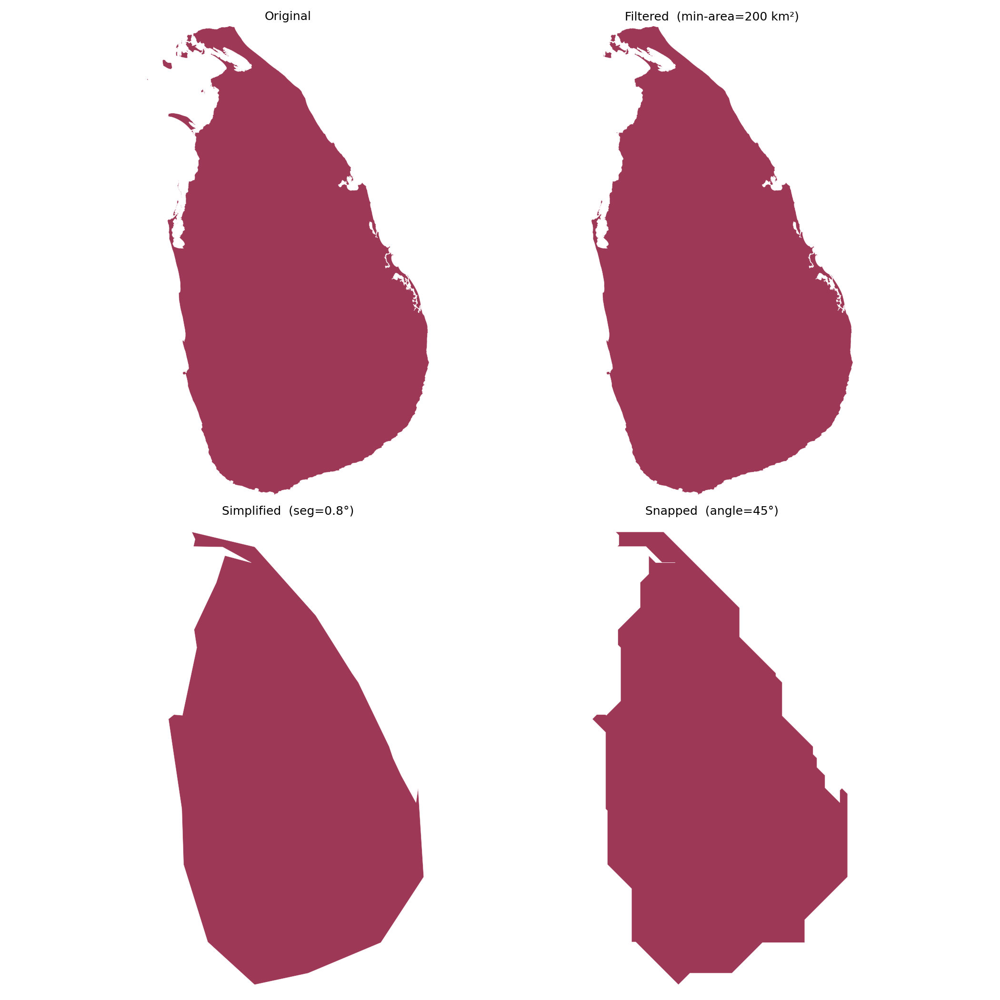
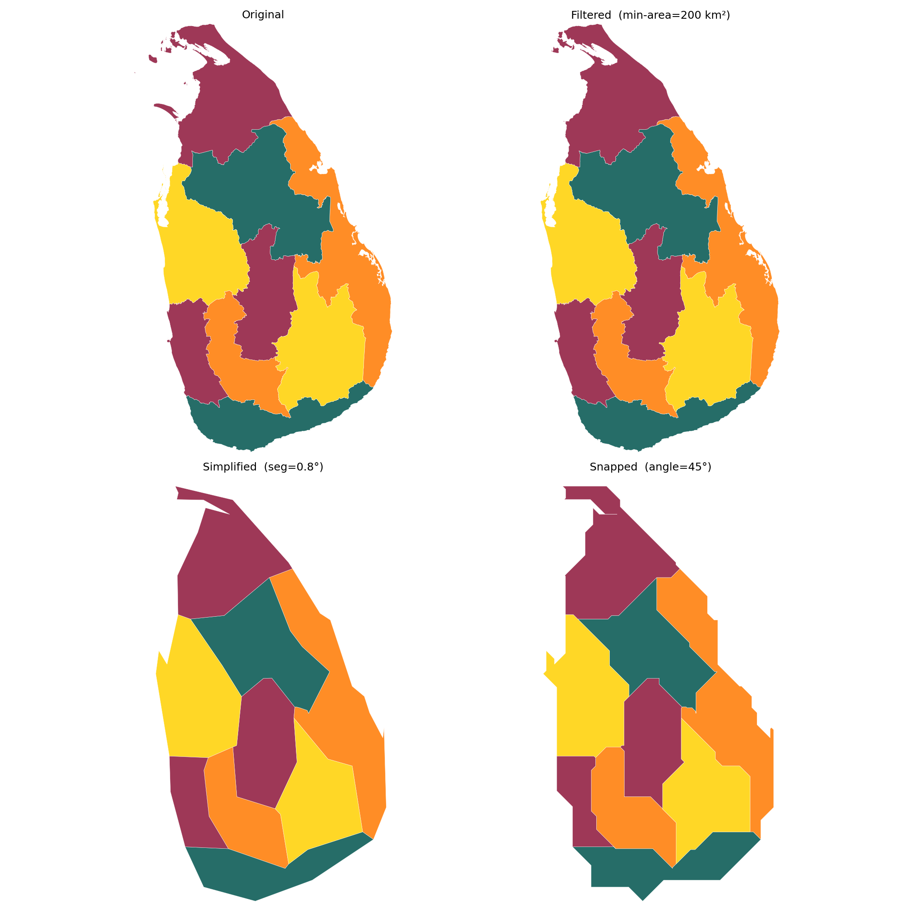
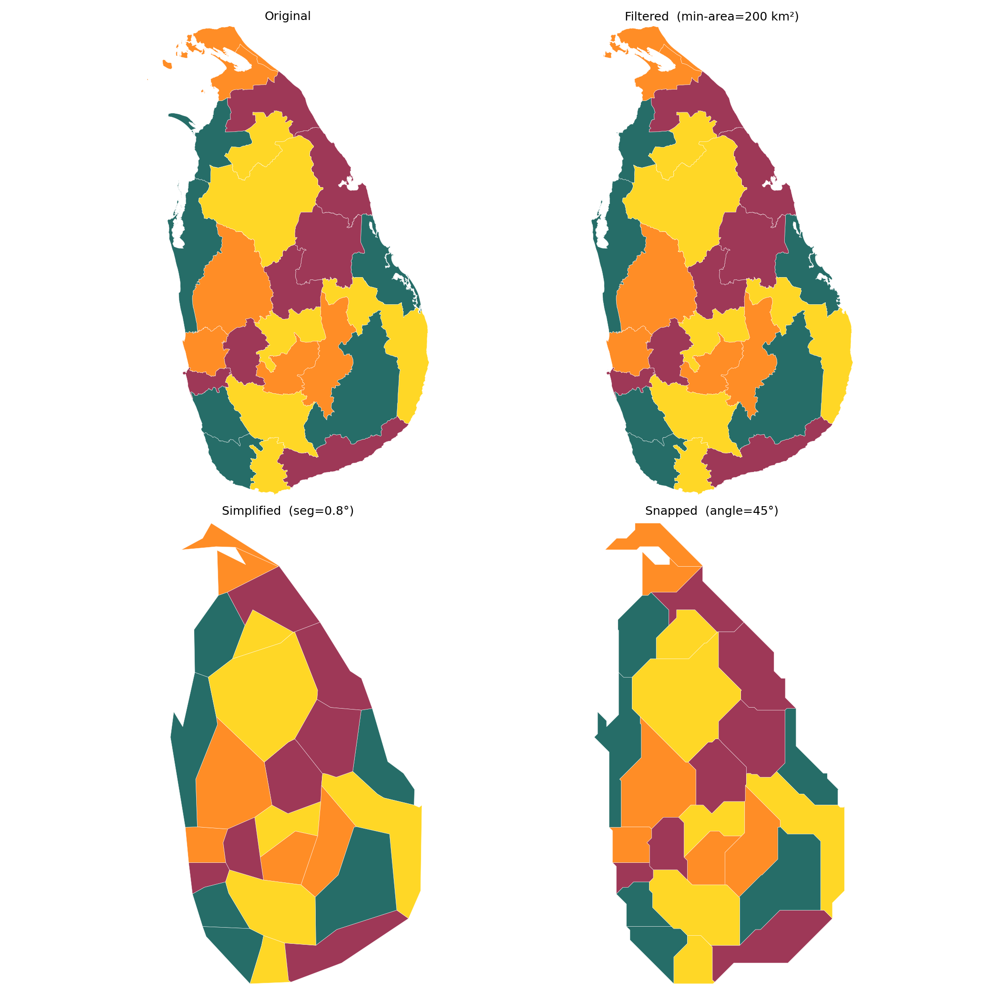

# octilinear

Octilinear maps are schematic diagrams in which every polygon boundary is
constrained to run at a multiple of a fixed angle — typically 45°, giving
eight possible directions (hence *octi*linear).  They trade geographic
precision for visual clarity, making administrative hierarchies, transit
networks, and choropleth data much easier to read at a glance.

This project implements a three-step pipeline that converts real-world
geographic TopoJSON files (currently Sri Lanka's administrative boundaries)
into clean octilinear diagrams.

---

## Why TopoJSON?

TopoJSON stores shared boundaries **once**, as *arcs*, rather than
duplicating them in each polygon.  This matters here for two reasons:

1. **Topology is preserved during simplification.** When two districts share
   a border, that border is a single arc.  Resampling or snapping it once
   keeps the two polygons perfectly stitched — no cracks or overlaps appear
   at shared edges.

2. **Compact delta encoding.** Arc coordinates are stored as integer deltas
   from the previous point, then decoded with a linear transform.  The
   original files contain ~280 000 points per district layer, compressed into
   a fraction of the space a plain GeoJSON would need.

---

## Pipeline

```
Input TopoJSON (data/original/)
        │
        ▼
┌───────────────────────────────────────────────────────┐
│ Step 1 – Filter                                       │
│   For each MultiPolygon, drop any sub-polygon whose   │
│   area < min_area km².  This removes small offshore   │
│   islands that would otherwise shrink to noise after  │
│   simplification.                                     │
│   → data/generate/filtered/                           │
└───────────────────────────┬───────────────────────────┘
                            │
                            ▼
┌───────────────────────────────────────────────────────┐
│ Step 2 – Simplify                                     │
│   Resample every arc so consecutive vertices are      │
│   ~segment_length degrees apart (chord-length walk).  │
│   Polygons that collapse to zero area are dropped.    │
│   → data/generate/simplified/                         │
└───────────────────────────┬───────────────────────────┘
                            │
                            ▼
┌───────────────────────────────────────────────────────┐
│ Step 3 – Snap to angle grid                           │
│   For each segment not already at a multiple of       │
│   angle_step°, insert one elbow point so that both    │
│   resulting segments ARE on the grid.  The elbow is   │
│   placed on the interior side of the polygon.         │
│   → data/generate/octilinear/                         │
└───────────────────────────┬───────────────────────────┘
                            │
                            ▼
        2×2 PNG (images/octilinear/)
        Original | Filtered
        Simplified | Snapped
```

---

## Installation

```bash
pip install -r requirements.txt
```

---

## Usage

```bash
python workflows/pipeline.py [input ...] \
    [--segment-length DEG] \
    [--min-area KM2] \
    [--angle-step DEG]
```

| Argument | Default | Meaning |
|---|---|---|
| `input` | all `data/original/*.topojson` | One or more input files |
| `--segment-length` | `0.02` | Target arc-segment length (degrees). Larger → coarser. |
| `--min-area` | `1.0` | Drop sub-polygons below this area (km²). |
| `--angle-step` | `45` | Snapping grid (must divide 360 evenly). 45 = octilinear, 60 = hexilinear, 90 = rectilinear, etc. |

Output files are named after their parameters so different runs never
overwrite each other:

```
data/generate/filtered/   <base>.min-area-<v>.topojson
data/generate/simplified/ <base>.min-area-<v>.seg-<v>.topojson
data/generate/octilinear/ <base>.min-area-<v>.seg-<v>.angle-<v>.topojson
images/octilinear/        <base>.min-area-<v>.seg-<v>.angle-<v>.png
```

---

## Examples

All examples below use `--min-area 200 --segment-length 0.8`.

### Country outline (1 feature)

```bash
python workflows/pipeline.py data/original/countrys.topojson \
    --segment-length 0.8 --min-area 200 --angle-step 45
```

The entire island of Sri Lanka as a single polygon.  Useful for checking
that coastline simplification and snapping produce a recognisable silhouette.
The 396-arc, 185 000-point original is reduced to 62 segments.



---

### Provinces (9 features)

```bash
python workflows/pipeline.py data/original/provinces.topojson \
    --segment-length 0.8 --min-area 200 --angle-step 45
```

Sri Lanka's 9 provinces.  At this scale the octilinear result is a
schematic that clearly shows the relative positions and sizes of each
province while remaining visually uncluttered.



---

### Districts (25 features)

```bash
python workflows/pipeline.py data/original/districts.topojson \
    --segment-length 0.8 --min-area 200 --angle-step 45
```

The 25 administrative districts — the most common unit for statistical
reporting in Sri Lanka.  With `--min-area 200` all offshore island
sub-polygons are filtered out, keeping only the mainland districts.  This
is the most useful layer for choropleth data visualisation.



---

### Divisional Secretariat Divisions — DSDs (339 features)

```bash
python workflows/pipeline.py data/original/dsds.topojson \
    --segment-length 0.8 --min-area 200 --angle-step 45
```

The finest administrative subdivision included here.  At `--min-area 200`
some coastal DSDs that consist mainly of small islands are filtered out
entirely (234 sub-polygons removed).  Increasing `--segment-length`
produces a coarser but faster result; decreasing it preserves more local
shape at the cost of a busier diagram.


---

## Varying the angle step

Any value that divides 360 evenly is accepted.  Some useful choices:

| `--angle-step` | Directions | Character |
|---|---|---|
| `90` | 4 | Rectilinear (Manhattan-style) |
| `60` | 6 | Hexilinear |
| `45` | 8 | Octilinear (default) |
| `30` | 12 | Dodecalinear |

```bash
# Rectilinear districts
python workflows/pipeline.py data/original/districts.topojson \
    --segment-length 0.8 --min-area 200 --angle-step 90
```

---

## Data

Source files in `data/original/` are TopoJSON exports of Sri Lanka's
official administrative boundaries:

| File | Features | Arcs | Points |
|---|---|---|---|
| `countrys.topojson` | 1 | 396 | 185 142 |
| `provinces.topojson` | 9 | 436 | 244 740 |
| `districts.topojson` | 25 | 504 | 281 433 |
| `dsds.topojson` | 339 | 1 796 | 592 114 |
